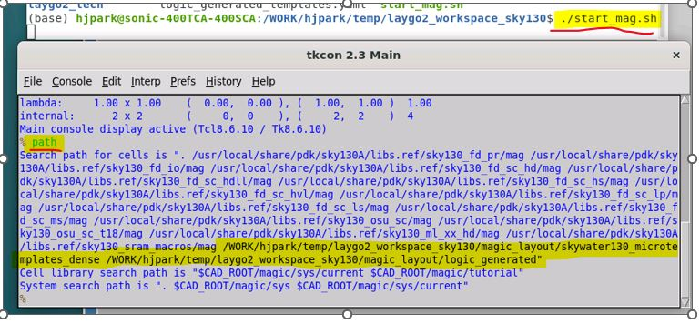
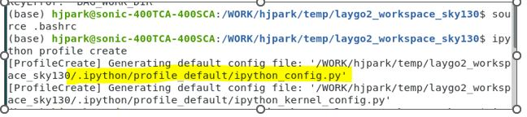
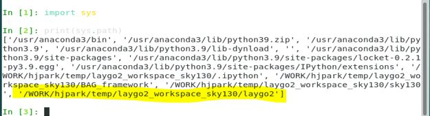

Workspace Setup
=========================

Step 1 : Clone repository
----------------------------

Clone laygo2_workspace_sky130 from github_

.. code-block:: bash
    
   $ git clone https://github.com/niftylab/laygo2_workspace_sky130.git
   $ cd laygo2_workspace_sky130
   $ git submodule init
   $ git submodule update

.. _github: https://github.com/niftylab/laygo2_workspace_sky130.git

Step 2: Set path variables for magic
-------------------------------------------

Initialize magic template cell search path for this tutorial

.. code-block:: bash

   $ ./mag_set_path.sh
   $ ./start_mag.sh
   % path

These .sh scripts initialize the ‘.maginit_personal’ file with the cell search path for ‘magic’. 
Your magic search path should include the following directories.

* WORK_DIR/magic_layout/skywater130_microtemplates_dense
* WORK_DIR/magic_layout/logic_generated

These paths are the default template paths for the example code in laygo2.

Step 3 : Test laygo2
-----------------------

.. note:: Several package prerequisites (such as Numpy) should be installed for LAYGO2. The base installation of Anaconda fulfills the package requirements.

.. code-block:: bash

    $ source .bashrc
    $ ipython profile create
    $ cp ipython_config_init.py PROFILE_DIR/ipython_config.py
    $ ipython ( or ./start_bag.sh )

The '.bashrc' file sets the python path of laygo2 by setting environment variables.
The profile directory is printed to the shell. (Example: WORK_DIR/.ipython/profile_default/ipython_config.py)
Overwrite the default 'ipython_config_init.py' to the config file in the repository.

If PROFILE_DIR is not output, or it dosen't contain WORK_DIR, check if .ipython dir exists in WORK_DIR.
If so, PROFILE_DIR = WORK_DIR/.ipython/profile_default.

.. code-block:: python    
    
    import sys
    print(sys.path)

The printed python path should include 'WORK_DIR/laygo2'.

