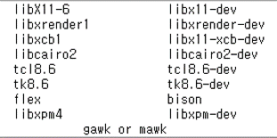
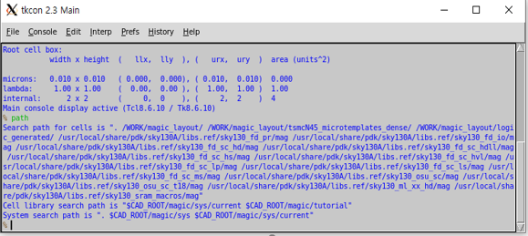
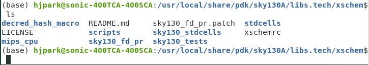
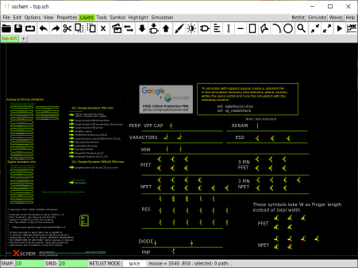

Environment Setup
=======================
.. note:: This tutorial requires sudo access. If you are not the owner of server or system, you should use virtual machine or docker.

Notation Guides:

- '$' means ubuntu shell commands
- '%' means tcl/tk console 
- ln[1] means interactive python command
- UPPER_CASE words denote user defined path

Install MAGIC
----------------
1. install dependent packages
~~~~~~~~~~~~~~~~~~~~~~~~~~~~~~~~~   
.. note:: CentOS use yum instead of apt-get package. Package names could be slightly different.

.. code-block:: 

    $ sudo apt-get install m4
    $ sudo apt-get install tcsh
    $ sudo apt-get install csh
    $ sudo apt-get install libx11-dev
    $ sudo apt-get install TCL-dev tk-dev
    $ sudo apt-get install libcairo2-dev

2. clone Magic source
~~~~~~~~~~~~~~~~~~~~~~~~
make or go to a directory for the source(DIR_FOR_SOURCE) and clone the source from git.

.. code-block::
    
    $ cd DIR_FOR_SOURCE
    $ git clone git://opencircuitdesign.com/magic

If it dosen't work, clone the Github mirror.

- $ git clone https://github.com/RTimothyEdwards/magic

.. note:: "apt-get install magic” command installs outdated version!

3. complie and Install
~~~~~~~~~~~~~~~~~~~~~~~~~~
This step requires a sudo acess.

.. code-block:: 

    $ cd magic
    $ ./configure
    $ make
    $ sudo make install

4. test
~~~~~~~~~~~~~

You can run magic on random directory.

- $ magic &

Check magic's cell search path with following

- % path
  
If CAD_ROOT appears after "System search path is", 
you have to set CAD_ROOT as an environment variable pointing where magic basic libraries are installed.

- the default is '/usr/local/lib'

Install XSHCEM, NETGEN, NGSPICE
---------------------------------

1. XSCHEM
~~~~~~~~~~~~~~~
Install following packages using “sudo apt-get install”

Clone xshcem source and install

.. code-block:: 

    $ cd DIR_FOR_SOURCE
    $ git clone https://github.com/StefanSchippers/xschem.git_
    $ cd xschem
    $ ./configure --prefix=ROOT_FOR_XSCHEM (default: '/usr/local')
    $ make
    $ make install

2. NETGEN
~~~~~~~~~~~
.. code-block:: 

    $ cd DIR_FOR_SOURCE
    $ git clone git://opencircuitdesign.com/netgen
    $ cd netgen
    $ ./configure
    $ make
    $ sudo make install

3. NGSPICE
~~~~~~~~~~~~~
NGSPICE uses wget instead of github clone

.. code-block:: 

    $ cd DIR_FOR_SOURCE
    $ wget  https://sourceforge.net/projects/ngspice/files/ng-spice-rework/37/ngspice-37.tar.gz
    $ tar -zxvf ngspice-37.tar.gz
    $ cd ngspice-37
    $ mkdir release
    $ cd release
    $ ../configure --with-x --enable-xspice --enable-cider --enable-openmp --with-readlines=yes --disable-debug
    $ make
    $ sudo make install

Install SKY130-PDK
-----------------------
1. Google/Skywater open SKY130-PDK
~~~~~~~~~~~~~~~~~~~~~~~~~~~~~~~~~~~~~
Clone PDK source from github and activates submodules. 
Since laygo2 doesn't use digital-standard libraries, we install primitive and IO libraries only.

.. code-block:: 

    $ cd DIR_FOR_SOURCE
    $ git clone https://github.com/google/skywater-pdk
    $ cd skywater-pdk
    $ git submodule init libraries/sky130_fd_io/latest
    $ git submodule init libraries/sky130_fd_pr/latest
    $ git submodule update
    $ make timing

2. setup pdk using open-pdks
~~~~~~~~~~~~~~~~~~~~~~~~~~~~~~~~

App open-pdks installs Skywater-pdk into PDK_ROOT directory and generates magic library files with them. 
And download some useful 3rd-party libraries such as primitives for xschem.

.. code-block:: 

    $ cd DIR_FOR_SOURCE
    $ git clone git://opencircuitdesign.com/open_pdks
    $ cd open-pdks
    $ ./configure --enable-sky130-pdk-DIR_FOR_SOURCE/skywater-pdk --disable-alpha-sky130

Before the install, check these considerable options of configure script.

1. --prefix=PDK_ROOT
   
   - pdk files are installed in 'PDK_ROOT/share/pdk'
   - default PDK_ROOT: '/usr/local'
   - we use default path in this tutorial

2. --enable-xschem-sky130[=PATH]
   
   - If not disabled, the 3rd-party Sky130 setup for xschem will be installed as part of the sky130A PDK. 
   - If path is omitted, or the configuration option is not specified, then the library will be pulled automatically from the repository_ and installed.
   - To disable the package, use --disable-xschem-sky130.

.. _repository: https://github.com/StefanSchippers/xschem_sky130

3. --enable-alpha-sky130[=PATH]

   - The 3rd-party alphanumeric layout library will be installed. Everything else are identical with 2.

If you choosed and set the configuration, you can install now.
**It could take times**.

.. code-block:: 

    $ make
    $ sudo make install

Set startup file for MAGIC and XSCHEM
-------------------------------------------

1. MAGIC
~~~~~~~~~~~~

We need a symbolic link mapping sky130 tech-files into MAGIC system search path.

- $ sudo ln -s SKY130A_INTALL_ROOT_DIR/sky130A/libs.tech/magic/* /usr/local/lib/magic/sys/

default **SKY130A_INTALL_ROOT_DIR** is '/usr/local/share/pdk'. Which is identical to the "PDK_ROOT/share/pdk".

Set the .magicrc at home directory.

.. code-block:: 

    $ cd ~
    $ cat > .magicrc (press enter key)
    source $CAD_ROOT/magic/sys/sky130A.magicrc

Test whether it is connected well.

.. code-block:: 

    $ magic &
    % path

It success if result looks like below.
 

2. XSHCEM
~~~~~~~~~~~~

**Check xschem_sky130 library**

xschem_sky130 library should have installed in SKY130A_INSTALL_ROOT_DIR/sky130A/libs.tech

.. code-block:: 

    $ cd SKY130A_INSTALL_ROOT_DIR/sky130A/libs.tech 
    $ cd xschem
    $ ls

If following directories didn’t appear, you should download it manually.

**Set xschemrc**

.. code-block:: 

    $ cd ~/.xschem
    $ cat > xschemrc (press enter)
      source /usr/local/share/pdk/sky130A/libs.tech/xschem/xschemrc (press ctrl+D to finish writing)
    $ xschem

Result should be looked like an image below.

Select the desired cell and press 'e' to check various circuits.

