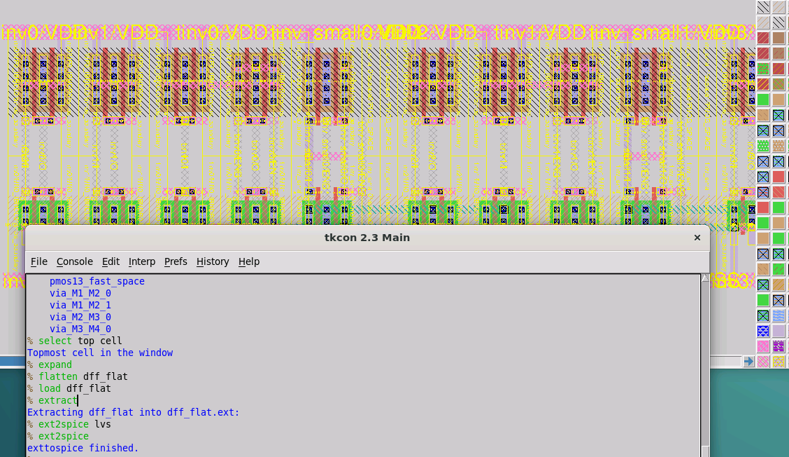

Run LVS
==============

Goal : Run Netgen for LVS test
-------------------------------------

.. In this tutorial, we will run netgen with the DFF cell we created in the previous section. Netgen is an open source lvs testing program. Netgen can only read SPICE files in a limited format.
.. So this tutorial extracts the SPICE format file and edits some of it so that netgen can read it properly.

In this tutorial, we will run Netgen over the DFF cell we created in the previous section. Netgen is an open-sourced program for LVS check.
As Netgen can only read SPICE netlists in a restricted format, this tutorial manipulates netlists accordingly after extraction.

Step 1 : Extract a SPICE netlist from the DFF cell
-----------------------------------------------------

.. For some reasons, magic often extracts only part of netlists from hierarchial cells. 
.. So, we have to flatten hierarchial DFF cell before we extract the netlist.

For unclear reasons, magic often extracts only a part of netlists from hierarchical cells.
So, we have to flatten the hierarchical DFF cell before we extract the netlist.

::

    % load logic_generated_dff_2x  
    % select top cell
    % expand
    % flatten dff_flat
    % load dff_flat
    % extract
    % ext2spice lvs
    % ext2spice

You can see the colors changed when you load the dff_flat layout.

Turn off magic. Ignore the caution again this time, as you don't need a flat layout file.

.. This is how to extract SPICE netlists from magic. Originally we were supposed to use the netlist we just extracted, 
.. but since this cell is made for subcells, there are no taps (body contact). 
.. So, in this tutorial, we will use the netlist extracted after adding the taps separately.

One step needs to be done before running the LVS. As the generated DFF cell does not contain taps inside
(as typically the taps are placed as separate instances), we need to manually insert manual taps before running LVS.

.. If you are familiar with magic, you can draw taps on the DFF layout and extract it in the same way.
.. If not, use "dff_tap.spice" in the 'lvs_example' directory of your workspace.
.. This example file is for those unfamiliar with magic. This tutorial uses 'dff_tap.spice'.

You can either 1) manually draw taps by yourself, if you are familiar with magic.
Otherwise, use the 'dff_tap.spice' file in the 'lvs_example' directory in your workspace.
This tutorial uses ‘dff_tap.spice’.

Step 2 : Edit SPICE netlists from schematic for Netgen
----------------------------------------------------------

.. Now SPICE from layout is ready. We are going to edit SPICE from schematic editer(xschem) in this step.
.. There are many articles for extracting SPICE from xschem, so I'll skip that procedure and use 'DFF_tinv.spice' which was extracted from xschem.
.. The DFF_tinv is topologically identical with the DFF_tap with different mosfet finger numbers.

Now we have the extracted netlist from the layout. The next step is extracting the netlist from the schematic for comparison.
There are many reference articles you can find out online for drawing/extracting netlists from xschem, an open-sourced schematic editor.
For this tutorial, we are going to use ‘DFF_tinv.spice’, which is extracted from xschem and has the identical topology with 'DFF_tap' (the finger numbers are different).

You must delete the parameters defined by the equation before running Netgen. Because Netgen can't read these equations and it throws a segmentation fault!
Fortunately, key parameters like width, length, and finger number are constant values. So we simply drop the parameters expressed as equations.

Copy the DFF_tinv file and edit on vim.

.. code-block:: bash

    $ cd WORK_DIR/lvs_example
    $ cp DFF_tinv.spice DFF_tinv_lvs.spice
    $ vim DFF_tinv_lvs.spice

Delete mosfet parameters expressed as equations(see highlighted terms).
Do this for every .subckt.

Step 3 : Run Netgen
------------------------
.. Now we can run lvs test with Netgen.

Run the following commands for the LVS test with Netgen.

::

    $ cd WORK_DIR
    $ netgen
    % lvs {lvs_example/dff_tap.spice dff_tap} {lvs_example/DFF_tinv_lvs.spice} SD_permute.tcl test_lvs.out

.. If you git result like figure, success!

If you get a result like the following figure, you are all set!

.. Now let's see the output logfile. Close Netgen and open the logfile.

Now let’s check the output logfile. Close Netgen and open the logfile by running the following command.

:: 

    $ vim test_out.out

You can see the following result.

It says netlists match uniquely.
But below the note, there are several mismatch messages.

.. But below the note, there's a mismatch log.

..  This is a parameter mismatch log that comes from the finger difference between xschem and magic and the difference in parameter notation.
    For example magic uses 'l' for length whereas xschem uses 'L'. Netgen cannot catch that they are equivalent.
    For parallel networks, magic uses m=2 (or nf = 2), whereas for xschem it doubles the parameters for two-finger MOSFETs.

The parameter mismatch messages come from 1) parameter naming differences and 2) the finger differences between xschem and magic. 
For example, magic uses ‘l’ for the MOSFET channel length whereas xschem uses ‘L’. Netgen cannot catch that they are actually equivalent. 
For fingered transistors, xschem uses m=2 (or nf = 2), whereas magic prints parameters of each finger of MOSFETs.
**As a result, these two circuits are identical even though Netgen throws the parameter errors.**
Even when there are serious parameter mismatches, you can catch them by reading the log.
