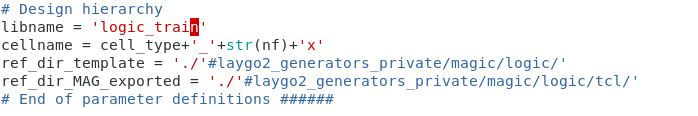

Library Management
=======================

Personal Library
--------------------

Create a directory with the same name as the library in the magic_layout directory

Add new library path in '.maginit_personal' file in workspace directory.

Now you can use this library. 
See "Testing the new libraries" section for instructions on how to determine which library your Python code will generate layout files to.

Public Library
-----------------

You can create library directory outside of workspace directory also.

Add new public library path in .maginit file. 

If you are working on a team project, 
You can use this kind of public library.
However, this method requires editing and sharing the tracked '.maginit' on Github.
In this case, consider using a **forked workspace repository**.
When a project master forks the repository and the team members clone the forked repository instead of the default workspace repository, tracked files can be reliably modified and shared via Github.

Testing the New Libraries
---------------------------

To change generation path, you have to change some variables in python code.
First, change the libname into new library name(logic_generated -> logic_train).

Then, change 'libpath' into where logic_train directory is placed.
The 'libpath' is a parameter of the function "laygo2.interface.magic.export".
In this tutorial, libpath = "/WORK/magic_layout" 

Generate TCL and mag file in the same way as in the previous section.

Close magic and check if the mag file is generated in logic_train.

Open magic again and load the layout itself in the public library.

::

    % load logic_train_tinv_small_1x

You can see the layout is loaded. Now you can use this library through laygo2. 

