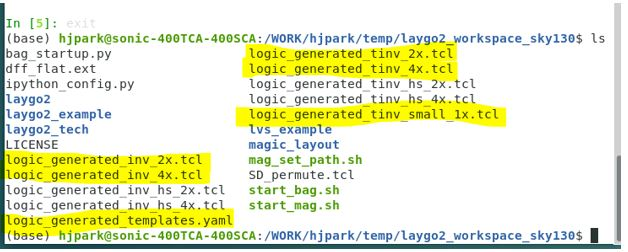
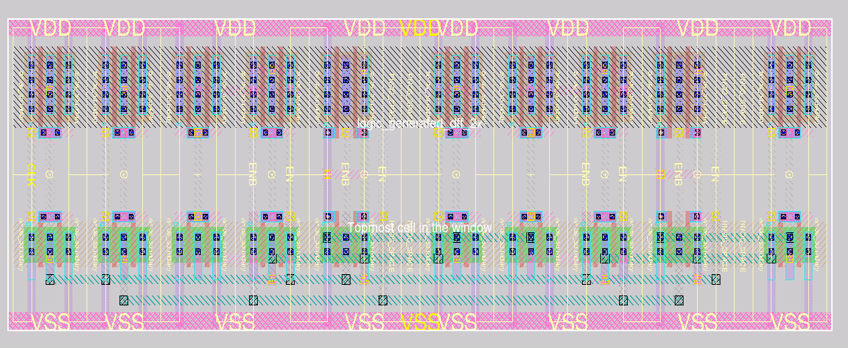

Run Example Code
=======================

Goal : Generate a D Flip-Flop layout
---------------------------------------

In this tutorial, we are going to generate a D Flip-Flop cell with laygo2 and magic. 

.. Since, DFF consists of some subcells like inverter, tri-state inverter, etc, we should generate subcells first.

.. As the D Flip-Flop is composed of multiple subcells such as inverter and tri-state inverter, we should generate the subcell layouts before generating the DFF layout.

As the D Flip-Flop is composed of multiple subcells such as inverter and tri-state inverter,
we should generate the subcell layouts before generating the DFF layout.

Step 1 : Subcell layout generation
--------------------------------------
.. Generate TCL script for subcells with laygo2. Run ipython and run the following commands

Running the following commands in ipython generates magic TCL scripts.

.. code-block:: python

    ln [1]: run laygo2_example/inv.py
    ln [2]: run laygo2_example/tinv.py
    ln [3]: run laygo2_example/tinv_small_1x.py
    ln [4]: exit

.. Yellow-lined files must be generated

If the generators ran successfully, you should see the highlighted files in the following figure:

.. Magic generates layout by reading TCL files from laygo2. Run magic and read TCL files we just generated.

The actual layouts are generated by running the TCL scripts in magic by typing the following commands:

::

    $ ./start_mag.sh
    % source logic_generated_inv_2x.tcl
    % source logic_generated_inv_4x.tcl
    % source logic_generated_tinv_2x.tcl
    % source logic_generated_tinv_4x.tcl
    % source logic_generated_tinv_small_1x.tcl

.. Off magic. Ignore the saving warning. (Actually, the cells are already saved.)

Turn off magic if you confirmed that the subcell layouts are generated
(You may see warning messages about saving the designs.
You can ignore the messages, as the cells are actually generated/saved).

Step 2: DFF layout generation
--------------------------------

.. Now we can generate a TCL file for DFF.

Now, you can generate the DFF layout by running the following Python and TCL commands.

.. code-block:: python

    ln [1]: run laygo2_example/dff.py
    ln [2]: exit

::

    % source logic_generated_dff_2x.tcl
    % source logic_generated_dff_4x.tcl
    % load logic_generated_dff_2x
    % select top cell
    % expand

.. Now you can see a layout of DFF like this image.

Now, you can see a layout of DFF as shown in the following figure.

